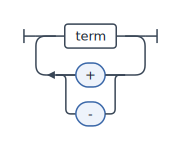
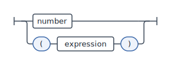
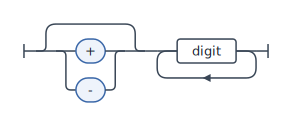

# Syntax Diagram Generator

Generate **railroad (syntax) diagrams** from an EBNF grammar, right in your
browser. Paste a grammar, get one clean diagram per rule, and export to **SVG**
(for the web/docs) or **TikZ** (for LaTeX). No backend, no build required to use
it — everything runs client-side.

The parser, layout engine, and both renderers are written from scratch (no
third-party railroad library), around a single measured diagram tree that every
output backend consumes.

**[Try it live →](https://ys-math.github.io/syntax-diagram-generator/)**

## Examples

Each of these is the actual SVG output for a single rule (regenerate them with
`npx vite-node scripts/gen-samples.ts`). For a fuller, printable reference —
every EBNF construct paired with its diagram, plus EBNF described in EBNF — see
[`samples/samples.pdf`](samples/samples.pdf) (regenerate with `npm run samples`).

`expression = term, { ("+" | "-"), term };` — concatenation with a repeated,
alternating separator:



`factor = number | "(", expression, ")";` — alternation between a reference and a
parenthesised sub-expression:



`signed number = [ "+" | "-" ], digit, { digit };` — an optional leading sign
followed by one-or-more digits:



## Features

- **EBNF → diagrams** following **ISO/IEC 14977**, including the tricky bits:
  special sequences, exceptions, and repetition factors.
- **One diagram per rule**, stacked with headings; nonterminal references appear
  as reference boxes.
- **Two export backends from one layout pass**
  - Self-contained **SVG** (embedded styles — renders correctly when dropped into
    any HTML/doc), download or copy.
  - **TikZ** code panel — copy it into a LaTeX document (`\usepackage{tikz}` +
    `\usepackage{xcolor}` + `\usepackage{adjustbox}`), compiles under
    pdflatex/xelatex/lualatex.
  - Per-rule, plus "Download all SVG" (one combined file) and "Copy all TikZ".
- **Fits the LaTeX page**, via the **Fit** control:
  - **Shrink** (default) — the diagram is wrapped in `\adjustbox{max size={\linewidth}{\textheight}}`,
    so a diagram larger than the text block scales down to fit *both* page width and
    height (and is left untouched if it already fits). Swap `\linewidth`/`\textheight`
    for fixed sizes to adjust.
  - **Wrap** — a long top-level sequence *snakes* across multiple rows at the chosen
    **Width (cm)** instead of shrinking, keeping every box at natural, readable size.
    The on-screen preview snakes too, so it matches the LaTeX output. The same
    adjustbox backstop still applies, so an intrinsically tall diagram never overflows.
- **Live, debounced** rendering as you type.
- **Structured parse errors** with line/column and expected-vs-found; the last
  good diagrams stay on screen while you fix a typo.
- **Light/dark** UI; exported diagrams stay on a neutral light theme so they look
  right in any document.

## Using the TikZ output in LaTeX

Each TikZ snippet is self-contained — it defines its own colors and begins with a
`% <rule name>` comment. Add three packages to your preamble and paste the snippet
into the document body:

```latex
\documentclass{article}
\usepackage{tikz}
\usepackage{xcolor}
\usepackage{adjustbox}
\begin{document}

% expression
\definecolor{sdgLine}{RGB}{57,70,86}
% … rest of the copied snippet …

\end{document}
```

Fitting the page:

- The picture is wrapped in `\adjustbox{max size={\linewidth}{\textheight}}`, so it
  scales down to fit **both** the text width and height, and is left at natural size
  when it already fits. Replace `\linewidth`/`\textheight` with fixed lengths (e.g.
  `0.8\textwidth`) to pin a size.
- For a long rule, prefer **Wrap** mode (the **Fit** control): it snakes the sequence
  across rows at the chosen **Width (cm)** instead of shrinking, keeping the boxes at
  readable size. Set that width to roughly your `\linewidth`.
- Compiles under **pdflatex**, **xelatex**, and **lualatex**. For terminals with
  **non-ASCII** characters, use xelatex/lualatex (or add `\usepackage[utf8]{inputenc}`
  under pdflatex).

## Supported EBNF (ISO/IEC 14977)

Select **EBNF (ISO/IEC 14977)** in the dialect dropdown. The parser understands:

| Construct            | Syntax                          | Rendered as                          |
| -------------------- | ------------------------------- | ------------------------------------ |
| Rule                 | `name = … ;`                    | a diagram titled `name`              |
| Concatenation        | `a , b`                         | sequence, left-to-right              |
| Alternation          | `a \| b` (also `/`, `!`)        | stacked branches                     |
| Optional             | `[ a ]`                         | bypass line above                    |
| Repetition (0+)      | `{ a }`                         | loop with a bypass                   |
| Grouping             | `( a )`                         | (transparent)                        |
| Repetition factor    | `3 * a`                         | loop annotated `3×`                  |
| Exception            | `a - b`                         | one annotated box `a − b`            |
| Terminal string      | `"if"` or `'+'`                 | rounded (stadium) box                |
| Meta identifier      | `a`, `single definition`        | rectangular reference box            |
| Special sequence     | `? any unicode char ?`          | distinct (amber) box                 |
| Comment              | `(* … *)`                       | ignored                              |
| Terminator           | `;` (also `.`)                  | ends a rule                          |

Notes:

- Meta identifiers may contain internal spaces per ISO (collapsed to one space).
- Non-ASCII terminals need xelatex/lualatex — see
  [Using the TikZ output in LaTeX](#using-the-tikz-output-in-latex).

BNF and ABNF are planned — see the roadmap.

## Development

```bash
npm install
npm run dev        # start the dev server
npm test           # parser unit tests + renderer golden snapshots (Vitest)
npm run build      # typecheck + static build into dist/
npm run preview    # serve the production build locally
```

### Architecture

```
text
  → parser/    ISO 14977 tokenizer + recursive-descent → Grammar AST
  → model/     Grammar AST → dialect-neutral diagram tree
  → layout/    annotate each node with width + up/down extents (no coordinates)
  → render/    draw pass computes geometry; SVG & TikZ backends emit output
  → ui/        vanilla-DOM app: live render, errors, export
```

Two extension seams:

- **New dialect** — add a parser targeting the same `Grammar` AST and register it
  in `src/parser/index.ts`. Nothing downstream changes.
- **New output format** — implement `DiagramBackend` (`src/render/backend.ts`)
  over the shared draw pass. No layout logic to duplicate.

## Deploying to GitHub Pages

A workflow at `.github/workflows/deploy.yml` builds and publishes `dist/` on every
push to `main`.

1. In the repository, go to **Settings → Pages → Build and deployment** and set
   **Source** to **GitHub Actions**.
2. If your repository is **not** named `syntax-diagram-generator`, update
   `BASE_PATH` in the workflow (and `base` in `vite.config.ts`) to `/<repo>/`.
3. Push to `main`. The site publishes at
   `https://<user>.github.io/<repo>/`.

## Roadmap

- BNF and ABNF (RFC 5234/7405) parsers into the same AST
- Dialect auto-detection
- PNG export

## License

[MIT](./LICENSE)
